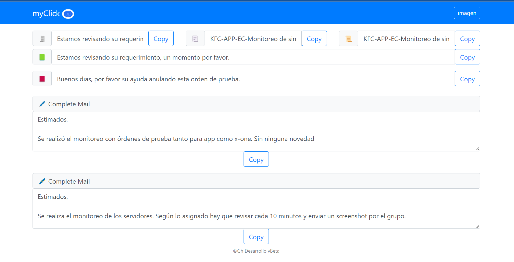

## Clipboard_Tool_Js

Click es una herramienta para tareas repetitiva como:

- Asuntos de correo.
- Responder un chat.
- Llenar un  correo.
- O enviar la misma información a varios clientes

### Que hace?

Tienes cuadros donde puedes llenar con tus textos, luego haces click en copiar y se te guarda el texto en tu navegador.
Cuando lo quieres utilizar solo das en copy y luego lo pegas donde necesites el texto.

### Adicional

Tienes un boton donde puedes redimencionar alguna imagen que necesites con medidas exactas.

### Tecnologias

Esta hecha en Html5, Bootstrap5, Css3, Js.

